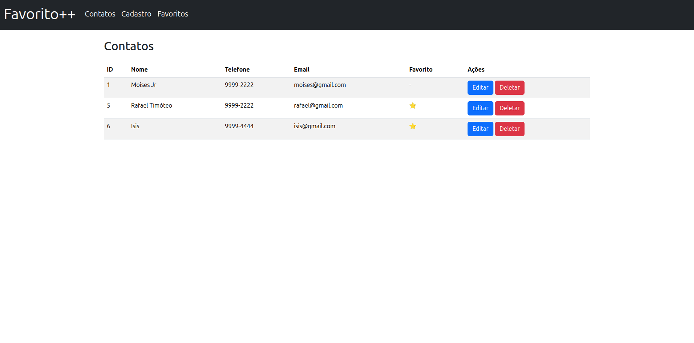

# 📇 Favorito++ - Agenda de Contatos

**Favorito++** é uma aplicação web simples para gerenciamento de contatos, onde você pode adicionar, editar, excluir e favoritar pessoas importantes. Ideal para estudar Flask, Bootstrap, SQLite e boas práticas de CRUD.

---

## 🚀 Tecnologias Utilizadas

- **Python 3.11+**
- **Flask** - Framework backend
- **SQLite** - Banco de dados leve e local
- **Bootstrap 5** - Estilização e modais
- **Jinja2** - Templates dinâmicos em HTML
- **jQuery** - Manipulação do DOM e eventos dos modais

---

## 💡 Funcionalidades

- [x] Adicionar novo contato
- [x] Listar todos os contatos
- [x] Editar informações de contato (via modal)
- [x] Excluir contato
- [x] Marcar/Desmarcar como favorito
- [x] Ícone e título personalizados no navegador

---

## 🗃️ Estrutura de Diretórios

```
FavoritoPlus/
│
├── static/
│   ├── css/
│   └── img/          # Contém favicon
│
├── templates/
│   ├── index.html    # Página principal
│   └── layout.html   # Layout base com Bootstrap
│
├── app.py            # Lógica principal com Flask
├── database.db       # Banco de dados SQLite
└── README.md
```

---

## 🛠️ Como executar o projeto localmente

### 1. Clone o repositório

```bash
git clone https://github.com/seu-usuario/FavoritoPlus.git
cd FavoritoPlus
```

### 2. Crie o ambiente virtual

```bash
python -m venv venv
source venv/bin/activate  # Linux/macOS
venv\Scripts\activate     # Windows
```

### 3. Instale as dependências

```bash
pip install -r requirements.txt
```

### 4. Execute o servidor

```bash
flask run
```

Acesse em `http://127.0.0.1:5000`.

---

## 🧪 Banco de dados

O banco `SQLite` é criado automaticamente, mas você pode inicializar manualmente com o seguinte script:

```sql
CREATE TABLE Contatos (
  id INTEGER PRIMARY KEY AUTOINCREMENT,
  nome TEXT NOT NULL,
  telefone TEXT NOT NULL,
  email TEXT NOT NULL,
  favorito INTEGER DEFAULT 0
);
```

---

## ✨ Print da aplicação

> 

---

## 🧠 Aprendizados

Este projeto visa consolidar os seguintes conceitos:

- Estrutura MVC com Flask
- Requisições POST/GET
- Manipulação de banco SQLite
- Templates dinâmicos
- Uso de modais Bootstrap para formulários

---

## 📄 Licença

Este projeto está sob a licença **MIT**. Veja o arquivo [LICENSE](LICENSE) para mais detalhes.

---

## 🙋‍♂️ Autor

Feito com 💙 por **Rafael Timóteo**

- [GitHub](https://github.com/seu-usuario)
- [LinkedIn](https://www.linkedin.com/in/seu-usuario)